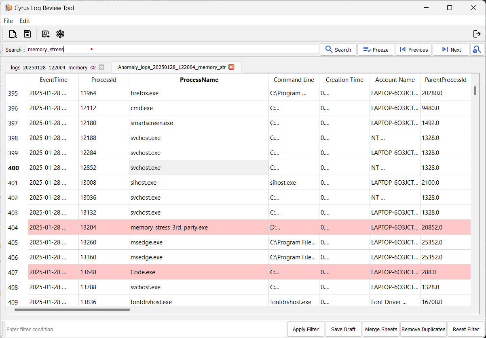

# ADVANCED TECHNIQUES FOR DETECTING ANOMALIES IN EDR LOGS FOR CYBERSECURITY

<p align="center">
  
</p>


---

This project focuses on building an AI-driven anomaly detection framework that uses the Isolation Forest algorithm to identify suspicious events in unstructured system log data. It is designed to assist Security Operations Center (SOC) analysts by providing scalable, real-time detection, dynamic process tree visualization, and explainable AI insights, , and **manual pivoting support** for more efficient cybersecurity monitoring.

## Setup Instructions

### 1. Install Requirements
First, install all necessary Python libraries using:

```bash
pip install -r requirements.txt
```

---

## Running the Project

### 2. Start the Logging Tool

This script monitors running processes and their network activities on a Windows system.
It collects detailed information like CPU usage, memory usage, file hashes, connections, and more.
The information is logged periodically into a CSV file stored under the user's Documents/logs folder.
Administrator privileges are required to access full process details.

Run the log extractor script to begin collecting system logs:

```bash
python logging/log_extracting.py
```

- This script must be run **with administrator privileges**.
- Logs will be saved automatically inside the `Documents/logs` folder.

---

### 3. Start the Main Application
After starting the log extractor, run the main application:

```bash
python main.py
```

## 🧠 Key Features

- **Isolation Forest Algorithm** for unsupervised anomaly detection.
- **Parent-Child Process Tree Visualization** using MSTICPy and NetworkX.
- **Manual Pivoting** capability to explore suspicious IPs, processes, or users.
- **Pivoting and Correlation Analysis** to link suspicious behaviors across logs.
- **Explainable AI (XAI)** to justify anomaly flags in plain language.
- **Automated Reporting** to summarize suspicious activity and reduce analysis time.
- **User-Friendly Desktop Application** built using PyQt5.

## 🏗️ System Architecture

1. **Data Ingestion**
   - Supports system logs in `.csv` format
2. **Preprocessing**
   - Label encoding, timestamp conversion, IP encoding, feature selection
3. **Anomaly Detection**
   - Isolation Forest for computing anomaly scores
4. **Visualization**
   - Process tree generation and anomaly highlights
5. **Reporting & XAI**
   - Natural language summaries of anomalies and process paths

## 📊 Technologies Used

- **Language**: Python
- **Libraries**: 
  - `scikit-learn` (Isolation Forest)
  - `pandas`, `numpy`
  - `PyQt5` (GUI)
  - `NetworkX`, `matplotlib` (Process Tree Visualization)
  - `MSTICPy` (Security Log Analysis)
- **Tools**: EDR logs, CSV log datasets

## 🧪 Results

- Achieved high accuracy with minimal false positives.
- Real-time detection with explainable outputs.
- Improved analyst efficiency and detection quality over rule-based and VTD methods.

## 📸 Screenshots





## 📈 Future Enhancements

  -  Real-time stream processing of logs

   - Integration with SIEM platforms

 - Cloud deployment and multi-user support

## 📄 License
 This project is licensed under the MIT License.

## 🙌 Contributors
- Balaji S – [21UIT022]

- Sriram@Muralidharan S – [21UIT162]

- Ragul S – [21UIT122]

- Guide: Dr. Puspita Dash, Associate Professor, Sri Manakula Vinayagar Engineering College.

## 📄 Publication

This project is based on our published IEEE research paper:  
🔗 [AI Enhanced Anomaly Detection of System Logs in Cyber Security](https://ieeexplore.ieee.org/document/10894286)
